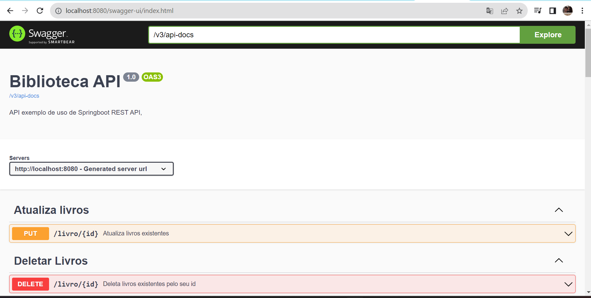

# Info geral - Situação de aprendizagem
api criada por greg, em caso de cópia sei la ve o log ai de quem commitou primeiro e tmj


# Funcionamento

## Inserção de roles no BD


MYSQL:\
INSERT INTO ROLE (NAME) VALUES("PRODUCT_SELECT");\
INSERT INTO ROLE (NAME) VALUES("PRODUCT_INSERT");\
INSERT INTO ROLE (NAME) VALUES("PRODUCT_UPDATE");\
INSERT INTO ROLE (NAME) VALUES("PRODUCT_DELETE");

POSTGRES:\
INSERT INTO ROLE (NAME) VALUES('PRODUCT_SELECT');\
INSERT INTO ROLE (NAME) VALUES('PRODUCT_INSERT');\
INSERT INTO ROLE (NAME) VALUES('PRODUCT_UPDATE');\
INSERT INTO ROLE (NAME) VALUES('PRODUCT_DELETE');


- Script postman para inserção de user para autenticação de rotas

```
{
"username": "admin",
"password": "123",
"roles":
[
{
"id": 1
},
{
"id": 2
},
{
"id": 3
},
{
"id": 4
}
]
} 
```

## Documentação

pode ser encontrada em:
http://localhost:8080/swagger-ui/index.html \
lembre de adicionar "/v3/api-docs" na busca



- Print de como fica salvo os usuários e suas senhas \
  


- Print de como fica as roles \
  

- Print de como fica as users_roles \
  [img_3.png](img_3.png) 


